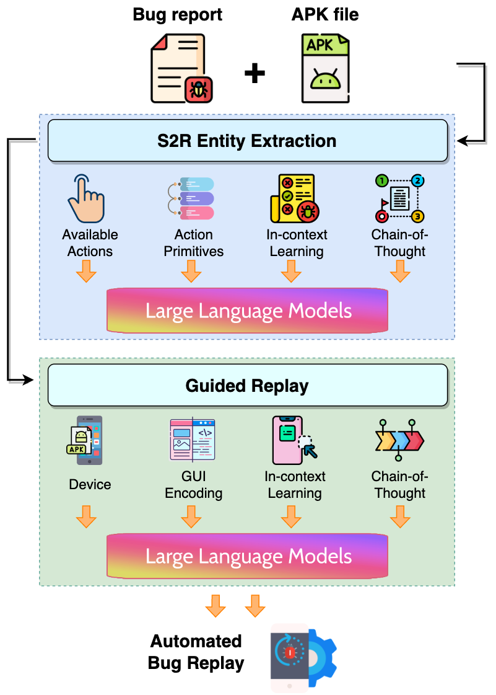

# Prompting Is All Your Need: Automated Android Bug Replay with Large Language Models

## Table of Contents
- [Table of Contents](#table-of-contents)
- [Getting Started](#getting-started)
- [Approach](#approach)
    - [S2R Entity Extraction](#s2r-entity-extraction)
    - [Guided Replay](#guided-replay)
- [Setup Instructions](#setup-instructions)
    - [Prerequisites](#prerequisites)
    - [Installation](#installation)
    - [Replay the Bugs](#replay-the-bugs)
- [Evaluation](#evaluation)
    - [RQ1: Performance of S2R Entity Extraction](#rq1-performance-of-s2r-entity-extraction)
    - [RQ2: Performance of Guided Replay](#rq2-performance-of-guided-replay)
    - [RQ3: Efficiency Performance](#rq3-efficiency-performance)
    - [RQ4: Usefulness of AdbGPT](#rq4-usefulness-of-adbgpt)

## Getting Started
Bug reports are vital for software maintenance that allow users to inform developers of the problems encountered while using the software. As such, researchers have committed considerable resources toward automating bug replay to expedite the process of software maintenance. Nonetheless, the success of current automated approaches is largely dictated by the characteristics and quality of bug reports. 

<p align="center">
 
</p>

Given the S2R shown above, extracting entities from the S2R requires a robust semantic and syntactic understanding.
For instance, the two `create` words in s2 and s3 are not semantically identical; one refers to `input` while the other refers to `repeat` the previous steps.
In s3, to `create another one`, a deep comprehension of the specific creation steps from the previous steps is needed.
Furthermore, a step may contain multiple sub-steps, such as s5.
Last but not least, in s5, the conjunction word `after` alters the temporal order of the steps.
These challenges surpass pre-defined word lists and are difficult to address using specific patterns based on previous works.
Second, the S2Rs are often incomplete, so much so that the previous automated approaches are unable to replicate the bugs. 

Inspired by the success of Large Language Models (LLMs) in natural language understanding, we propose AdbGPT, a new lightweight approach to automatically reproduce the bugs from bug reports through prompt engineering, without any training and hard-coding effort. AdbGPT leverages few-shot learning and chain-of-thought reasoning to elicit human knowledge and logical reasoning from LLMs to accomplish the bug replay in a manner similar to a developer. 


## Approach
<p align="center">
 
</p>
<p align="center">The overview of AdbGPT.<p align="center">

Given a bug report and the app, we propose an automated approach to extract the S2R entities and reproduce each step based on the current GUI state to trigger the bugs in the app.
It is divided into two main phases: 
(i) the *S2R Entity Extraction* phase, which extracts the S2R entities defining each step to reproduce the bug report, including action types, target components, input values, or scroll directions;
(ii) the *Guided Replay* phase that matches the entities in S2R with the GUI states to repeat the bug reproduction steps.

### S2R Entity Extraction
<p align="center">
 
</p>

We leverage LLMs, equipped with knowledge learned from large-scale training corpora, to provide an in-depth understanding of the potential entities presented in the bug report. 
Since a step can be expressed in various ways and with different words, we first provide LLMs with information about entity specifications, including available actions and action primitives, which can be mapped to instructions for device replay.
To help LLMs recognize our task and infer S2R entities, we provide a few examples of conditioning, such as an S2R as input, a chain-of-thought as reasoning, and the final entities as the output.

### Guided Replay
<p align="center">
 
</p>
we adopt LLMs with few-shot learning and chain-of-thought reasoning to generate dynamic guidance on the GUI screen, enabling automatic reproduction of the steps even when a step is missing.

<p align="center">
 
</p>
<p align="center">Illustration of GUI encoding.<p align="center">

One challenge in using LLMs for GUI guidance is that they can only process reasonably sized text input.
To help LLMs inherently understand GUI screens, we propose a novel method to transfer the GUIs into domain-specific prompts that the LLMs can understand.
Given each step and its current GUI screen, we prompt the LLMs to generate the target component to operate on, ultimately triggering the bug.

## Setup Instructions

### Prerequisites
- Python 3.10.9
- Android Emulators in Genymotion
- ADB (Android Debug Bridge) version 1.0.41

### Installation
Clone the repository and install the requirements.
```
git clone https://github.com/code-released/AdbGPT.git
pip install -r requirements.txt
```

### Replay the Bugs
1. We recommend using our OpenAI command-line interface (CLI). To setup
```
pip install --upgrade openai

# cfgs.py
OPENAI_TOKEN = <OPENAI_API_KEY>
```

2. Set your android device screen size
```
# utils/config.py
XML_SCREEN_WIDTH = 1440
XML_SCREEN_HEIGHT = 2960
```

3. Prepare the S2R from the bug reports and install the AUT
```
# main.py
bug_description = """
1. Go to General Settings -> Form management and unselect Hide old form versions option.
2. Click on Fill Blank Form from the main menu.
"""
```

4. Run the script. You should observe the automated bug replay with LLMs with processing in `loguru.log`. We also dump the GUI screenshots and corresponding view hierarchy in the folder as shown below.
```
python main.py
```
<p align="center">
 
</p>

## Evaluation
The main quality of our study is the extent to whether our AdbGPT can effectively and efficiently reproduce the bug reports.
Since our approach consists of two main phases, we evaluate each phase, including S2R Entity Extraction and Guided Replay.
<!-- To achieve our study goals, we formulate the following three research questions: -->

- **RQ1:** How accurate is our approach in extracting S2R entities?
- **RQ2:** How accurate is our approach in guiding bug replay?
- **RQ3:** How efficient is our approach in bug replay?
- **RQ4:** How usefulness is our approach for developers in real-world bug replay?

For RQ1, we present the general performance of our approach for S2R entity extraction and the comparison with state-of-the-art baselines. 
Besides, we also present the performance comparison among the variations of in-context learning (e.g., few-shot vs zero-shot) and the contribution of reasoning by comparing the performance with and without chain-of-thought.
For RQ2, we carry out experiments to check if our approach can trigger the target components, comparing with the baselines and ablations.
For RQ3, we evaluate the runtime overhead of our approach in bug replay.
For RQ4, we conduct a small-scale user study to evaluate the perceived usefulness of AdbGPT for automatically replaying bug reports in real-world development environments.

### RQ1: Performance of S2R Entity Extraction
<p align="center">
 
</p>

The performance of our approach is significantly better than that of other baselines in all metrics, i.e., on average 39.3%, and 42.2% more accurate in step extraction and entity extraction compared with the best baseline (MaCa).
In addition, applying few-shot learning and chain-of-thought which provide examples with intermediate reasons, can endow the LLMs with a better understanding of the task, resulting in a boost of performance from 84.6%, 87.6% to 90.8%.

<p align="center">
 
</p>

To fully explore the reason why our approach outperforms other baselines, we carry out a qualitative study by investigating the bug reports which are correctly extracted by our approach but wrongly extracted by the baselines.
We summarize three reasons, including inconsistent formats, dependent context, and diversified words. Albeit the good performance of our approach, we still make the wrong extraction for some bug reports due to ambiguous S2Rs written by the users.

### RQ2: Performance of Guided Replay
<p align="center">
 
</p>


Our approach outperforms all the baselines and ablations, i.e., on average 81.3% compared with 45.8%, 58.3%, and 62.5%, for ReCDroid, AdbGPT w/o Few, and AdbGPT w/o CoT, respectively.
We observe that chain-of-thought leads to a substantial improvement (i.e., 18.8% boost) in the performance of AdbGPT, indicating that the LLMs can better understand the task by processing it step-by-step.

<p align="center">
 
</p>

We further conduct a qualitative analysis to compare the capabilities of our approach with the baselines. Overall, we summarize two common reasons, including missing steps and component mismatch. Although our approach demonstrates good bug reproducibility, we still fail to reproduce some unclear S2Rs.

### RQ3: Efficiency Performance
<p align="center">
 
</p>

Our approach takes AdbGPT 255.75 seconds on average to reproduce a bug report, i.e., 2.11 seconds to extract the S2R entities from the bug report and 253.64 seconds to replay the S2R in the device.
In comparison, it takes the ReCDroid method on average 1360.92 seconds, indicating the efficiency of our approach which saves nearly 5x time per bug replay.
Notably, our approach accelerates 435% time in guiding replay in the GUI screen compared with ReCDroid.
This is primarily due to missing steps in the S2Rs, which cause ReCDroid to randomly explore the app with repeated back-and-forth exploration, which is a time-consuming process.


### RQ4: Usefulness of AdbGPT
<p align="center">
 
</p>

Although most participants can successfully finish the bug replay on time, AdbGPT reproduces the bug report much faster than that of participants (with an average of 330.4 seconds versus 269.4 seconds). 
All participants strongly favored using AdbGPT in practice, with an average preference score of 4.5 out of 5.0, and raise two critical challenges in practice which are addressed by our approach.
First, understanding the S2Rs from the bug reports is surprisingly time-consuming, as it involves grasping the context, reordering the steps, analyzing the potential actions and components, etc.
Second, it is difficult to determine the trigger for the missing steps, resulting in participants' guesses of the action for triggering the next steps.
That trial-and-error makes the bug replay process tedious and time-consuming.
It is especially severe for junior developers who are not familiar with the app.

## Citations
Please consider citing this paper if you use the code:
```
@inproceedings{feng2024prompting,
  title={Prompting Is All You Need: Automated Android Bug Replay with Large Language Models},
  author={Feng, Sidong and Chen, Chunyang},
  booktitle={Proceedings of the 46th IEEE/ACM International Conference on Software Engineering},
  pages={1--13},
  year={2024}
}
```